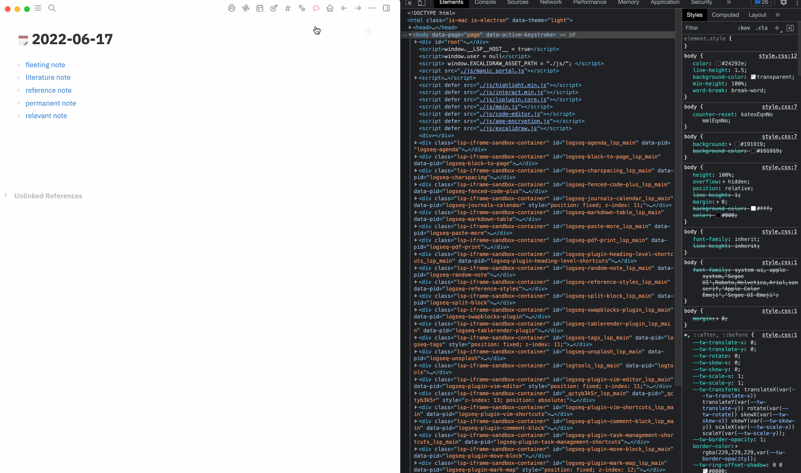

# Logseq Global Custom CSS

A plugin for Logseq themer. Logseq's custom.css give end user the ability to customize look and feel of Logseq over the theme layer, it's awesome but have some limits.

* Each repo has a custom.css, if you have many repos, you need to copy and paste changes all the time.
* You need to go back and forth to preview after editing.

## Features

With this plugins, it create a new workflow for themer to customize css globally.

* It's a CSS editor in popup modal which can be drag and drop.
* Support syntax highlight, and autocomplete.
* Code will be applied automatically.
* Save to/Load from Github Gists.
* Support fullscreen press F11.
* Support Code format.

## Workflow

* You can rely on this plugin to replace the original custom.css, so you can get the ability to edit once and use it globally.
* Or, you can just use it as a debug window, you can preview effects when you editing, then if it works, you can copy all code to custom.css, and clear the window.

## Settings

If you do not need to save code to Github Gist, it's an out-of-the-box. For now it can only be trigger from the right top corner, the colorful icon.

If you do need to save code to Github Gist, you need to config the plugin

### Github Personal Access Token

It's best only grant **Gist Create** permission for this token. You can apply it [here](https://github.com/settings/tokens).

### Gist ID

The plugin can not help you create a gist and alway use the created one to save code, so you need to set a specific gist id, the plugin will not touch any other your gists.

## Buy me a coffee

If my plugin solve your situation a little bit and you will, you can choose to buy me a coffee via [this](https://www.buymeacoffee.com/vipzhicheng) and [this](https://afdian.net/@vipzhicheng).

## Licence
MIT
